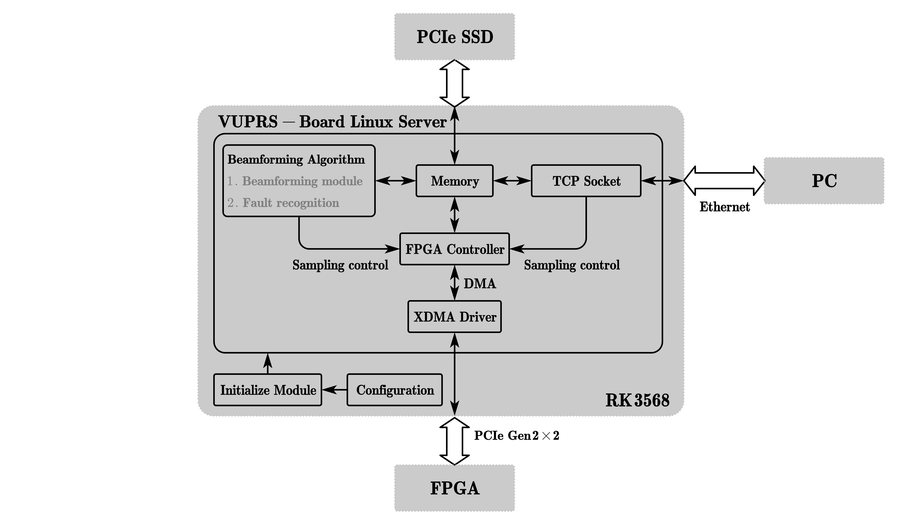

# VUPRS Server - 车下故障声学定位与识别系统 `Linux` 服务器.

  

[[ 回到主仓库: vuprs-support ]](https://github.com/ShixuanLiu9527/vuprs-support.git)

## Build

在项目根目录输入以下指令:  

    sudo mkdir build
    cd build
    sudo cmake .. -DCMAKE_TOOLCHAIN_FILE=../rk3568_toolchain.cmake
    sudo make

在 `/build` 目录下将会出现如下可执行文件:  

    /build/vuprs_server
    /build/fpga_tool/tool

## Usage

### 相关配置文件

为了方便系统运行和调整, 设置了 `4` 个配置文件, 分别为: `fpga_config.json`, `beam_forming_array.json`, `fir_config.json`, `server_config.json`.  
  
[[ 查看 `fpga_config.json` 模板 ]](./configs/fpga_config_template.json)  
[[ 查看 `beam_forming_array.json` 模板 ]](./configs/beam_forming_array_template.json)  
[[ 查看 `fir_config.json` 模板 ]](./configs/fir_config_template.json)  
[[ 查看 `server_config.json` 模板 ]](./configs/server_config_template.json)  
  
`fpga_config.json` 用于配置 `FPGA` 侧各个模块, 方便 `ARM` 端与 `FPGA` 通信.  
`beam_forming_array.json` 用于配置麦克风阵列, 通过配置该文件, 系统可以适配不同的麦克风阵列.  
`fir_config.json` 用于配置 `FIR` 滤波器模块参数.  
`server_config.json` 用于配置服务器信息, 包括服务器端口号, 命令流数据头数据尾等.  

## FPGA 读写测试工具 `FPGA-Tool`  

为了方便调试, 设计了 `FPGA` 调试工具, 可以通过终端手动控制 `FPGA`.  
  
[[ `FPGA-Tool`使用手册 ]](./ug-fpga-tool.md)  

## 网络通信协议

[网络通信协议V1.0](./docs/PROTOCOL.md)
