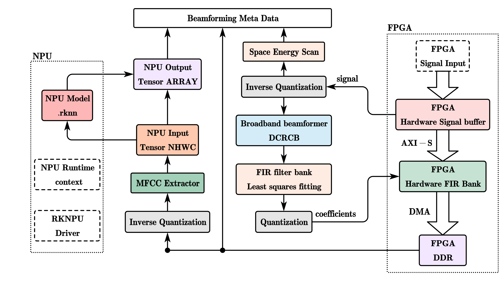

# VUPRS Server - 车下故障声学定位与识别系统 `Linux` 服务器端

<div align="center">
  
</div>

[回到主仓库: vuprs-support](https://github.com/ShixuanLiu9527/vuprs-support.git)

## 系统简介

`VUPRS Server` 是车下故障声学定位与识别系统的服务器端软件, 运行于 `RK3568` (ARM64) 平台, 与板载 `XC7A100T` (Artix-7) `FPGA` 通过 `XDMA` 进行高速数据交互, 完成声学信号的采集、波束形成、故障检测与识别, 并通过以太网 `TCP` 服务器对外提供命令与数据服务.

主要功能:

- **FPGA 数据采集**: 通过 `XDMA` 驱动与 FPGA 交互, 支持 `AXI-Lite` 寄存器读写与 `AXI-Stream` 数据流传输;
- **声学信号处理**: 波束形成 (`BF`) 与 `FIR` 滤波, 基于 `FFTW3` 加速;
- **故障检测与识别**: 特征提取 + `RKNN` `NPU` 推理 + 后处理, 支持故障声学目标识别;
- **网络服务**: 以太网 `TCP` 服务器, 支持命令流与控制流的解析与应答 (详见 [网络通信协议](#网络通信协议));
- **调试工具**: `FPGA-Tool` 终端工具, 支持读写 FPGA 寄存器与内存, 方便系统调试.

## 项目结构

```bash
root/
├── 3rdparty          # 第三方库: eigen, fftw3, nlohmann-json, rknpu2 (RKNN Runtime), spdlog
├── algorithm         # 算法模块
│   ├── bf            #   波束形成 (Beam Forming) 与 FIR 滤波
│   ├── inference     #   特征提取 / RKNN NPU 推理 / 后处理
│   └── signal_processing  # 信号处理
├── cmake             # CMake 辅助文件 (交叉编译工具链等)
├── configs           # 项目配置文件 (7 个 JSON 模板)
├── docs              # 项目相关文档
├── fault_detect      # 故障检测模块
├── fpga              # FPGA 通信与控制代码 (XDMA 设备封装、寄存器读写、数据转换)
├── fpga_tool         # FPGA 调试工具代码
├── hybrid            # 混合波束形成 (Hybrid Beam Forming) 模块
├── logger            # 系统日志管理 (spdlog 封装) 与参数检查
├── scripts           # 板端运行脚本 (create_run_dir / run_server / config_eth0 / load_xdma_driver)
├── server            # TCP 服务器代码 (协议解析、会话管理、Socket IO)
├── system_tools      # 系统通用工具 (对齐缓冲、文件处理、字符串解析)
├── xdma_driver       # XDMA 驱动源代码 (内核模块 xdma.ko)
├── build.sh          # 一键构建脚本 (XDMA 驱动 + 服务器 + FPGA-Tool)
├── CMakeLists.txt    # 顶层 CMake 工程文件
├── config.h          # 全局配置宏 (调试开关、算法参数等)
└── main.cpp          # 服务器入口
```

## 环境依赖

- `Linux` (开发机: x86_64; 目标板: RK3568, `aarch64`);
- `CMake` >= 3.10, 支持 `C++17` 的交叉编译器 (如 `gcc-linaro-7.5.0` aarch64 工具链);
- 目标板内核源码及其构建环境 (编译 `XDMA` 驱动用);
- `3rdparty` 中已内置 `eigen`、`fftw3`、`nlohmann-json`、`rknpu2`、`spdlog`, 无需额外安装.

## 构建

为了正常编译, 请按照以下步骤设置相关参数:

### Step 1: 在 `cmake/rk3568_toolchain.cmake` 中指定交叉编译器路径

```cmake
set(CMAKE_C_COMPILER "/usr/local/arm/gcc-linaro-7.5.0-2019.12-x86_64_aarch64-linux-gnu/bin/aarch64-linux-gnu-gcc")
set(CMAKE_CXX_COMPILER "/usr/local/arm/gcc-linaro-7.5.0-2019.12-x86_64_aarch64-linux-gnu/bin/aarch64-linux-gnu-g++")
```

[查看 `cmake/rk3568_toolchain.cmake`](./cmake/rk3568_toolchain.cmake)

### Step 2: 在 `build.sh` 中指定 XDMA 交叉编译相关参数

```shell
XDMA__ARCH="arm64"
XDMA__CROSS_COMPILE="/home/lsx/source/linux/rk356x_linux/prebuilts/gcc/linux-x86/aarch64/gcc-linaro-6.3.1-2017.05-x86_64_aarch64-linux-gnu/bin/aarch64-linux-gnu-"
XDMA__KERNEL_DIR="/home/lsx/source/linux/rk356x_linux/kernel"
```

[查看 `build.sh`](./build.sh)

### Step 3: 编译

在项目根目录运行 `build.sh` 脚本:

```bash
sudo sh ./build.sh all  # 编译全部 (XDMA 驱动, Server 和 FPGA-Tool)
```

其他命令:

| 命令 | 说明 |
| :--- | :--- |
| `sh ./build.sh all` | 编译 XDMA 驱动、Server 和 FPGA-Tool |
| `sh ./build.sh xdma` | 仅编译 XDMA 驱动 |
| `sh ./build.sh server` | 仅编译 Server 和 FPGA-Tool |
| `sh ./build.sh clean-all` | 清理所有编译产物 |
| `sh ./build.sh clean-xdma` | 清理 XDMA 驱动编译产物 |
| `sh ./build.sh clean-server` | 清理 Server 和 FPGA-Tool 编译产物 |
| `sh ./build.sh help` | 查看帮助信息 |

编译完成后, 在 `./build` 目录下将会出现如下文件:

```bash
build/
├── server                    # 服务器可执行文件
├── fpga_tool/
│   └── tool                  # FPGA Tool 工具
├── xdma/
│   └── xdma.ko               # XDMA 驱动
└── 3rdparty/fftw3/           # FFTW 动态库
    ├── libfftw3.so
    ├── libfftw3.so.3
    ├── libfftw3.so.3.6.9
    ├── libfftw3_threads.so
    ├── libfftw3_threads.so.3
    └── libfftw3_threads.so.3.6.9
```

## 部署与运行

### Step 1: 生成运行目录

编译完成后, 在项目根目录运行脚本 `create_run_dir.sh` 自动生成运行目录 `run_dir`:

```bash
sudo sh ./scripts/create_run_dir.sh
```

生成后的 `run_dir` 目录结构如下:

```bash
run_dir/
├── run_server.sh           # 启动脚本
├── xdma.ko                 # XDMA 驱动
├── server                  # 编译得到的服务器可执行文件
├── configs/                # 7 个配置文件
│   ├── fpga_config.json
│   ├── server_config.json
│   ├── array_config.json
│   ├── fir_config.json
│   ├── rknn_config.json
│   ├── hybrid_default_config.json
│   └── logger_config.json
├── fftw3/                  # FFTW3 动态链接库
├── rknpu2/                 # RKNN Runtime 动态链接库
└── model/                  # 模型目录 (将 `model.rknn` 放到此处)
```

注: 启动前请将推理模型 `model.rknn` 放入 `run_dir/model/` 目录 (路径对应 `rknn_config.json` 中的 `rknn-model.path`).

### Step 2: 配置启动脚本 (可选)

默认情况下 `run_server.sh` 已指向 `run_dir` 内的 `configs` 目录, 无需修改. 如需自定义配置路径, 编辑 `run_server.sh` 中的 7 个配置文件路径:

```shell
FPGA_CONFIG="./configs/fpga_config.json"
SERVER_CONFIG="./configs/server_config.json"
ARRAY_CONFIG="./configs/array_config.json"
FIR_CONFIG="./configs/fir_config.json"
INFERENCE_CONFIG="./configs/rknn_config.json"
HYBRID_DEFAULT_CONFIG="./configs/hybrid_default_config.json"
LOGGER_CONFIG="./configs/logger_config.json"
```

[查看 `run_server.sh`](./scripts/run_server.sh)

### Step 3: 配置以太网静态 IP 地址

在 `scripts/config_eth0.sh` 中设置以太网静态 IP (首次配置后脚本会将原配置备份为 `/etc/network/interfaces.bak_vuprs`):

```shell
INTERFACE="eth0"
STATIC_IP="192.168.1.100"
NETMASK="255.255.255.0"
GATEWAY="192.168.1.1"
DNS="114.114.114.114"
```

[查看 `config_eth0.sh`](./scripts/config_eth0.sh)

完成后, 在板端运行脚本文件:

```bash
sudo sh ./config_eth0.sh
```

### Step 4: 启动服务器

将 `run_dir` 目录拷贝到板端任意位置, 进入目录, 以 `root` 权限执行启动脚本 (脚本会自动加载 `xdma.ko` 驱动并启动服务器):

```bash
cd run_dir/
sudo sh ./run_server.sh
```

注: 脚本 `run_server.sh` 必须在 `root` 权限下执行.

## 相关配置文件

系统共设置 `7` 个 JSON 配置文件, 位于 [`configs/`](./configs/):

| 配置文件 | 说明 |
| :--- | :--- |
| `fpga_config.json` | FPGA 侧各模块配置 (总线地址、DMA、寄存器偏移等), 用于 ARM 端与 FPGA 通信 |
| `server_config.json` | 服务器信息配置, 包括端口号、命令流数据头/数据尾、协议指令集等 |
| `array_config.json` | 麦克风阵列配置 (阵元坐标、ADC 通道), 通过修改该文件可适配不同的麦克风阵列 |
| `fir_config.json` | FIR 滤波器模块参数配置 |
| `rknn_config.json` | RKNN 模型推理配置 (分析频率范围、帧时长、模型路径) |
| `hybrid_default_config.json` | 混合波束形成默认参数 (采样率、波束指向、声速等) |
| `logger_config.json` | 系统日志输出目录配置 |

## FPGA 读写调试工具 FPGA-Tool

为了方便调试, 设计了 `FPGA-Tool` 终端调试工具, 可以通过终端读写 FPGA 中的寄存器和内存.

使用前请先通过脚本 `load_xdma_driver.sh` 挂载 `xdma` 驱动 (挂载前请检查脚本同级目录下是否有驱动文件 `xdma.ko`):

```bash
sudo sh ./scripts/load_xdma_driver.sh
```

[查看 `load_xdma_driver.sh`](./scripts/load_xdma_driver.sh)
[FPGA-Tool 使用手册](./docs/ug-fpga-tool.md)

## 网络通信协议

[网络通信指令格式](./docs/protocol_cmd.md)

---
_Shixuan Liu 2025_
